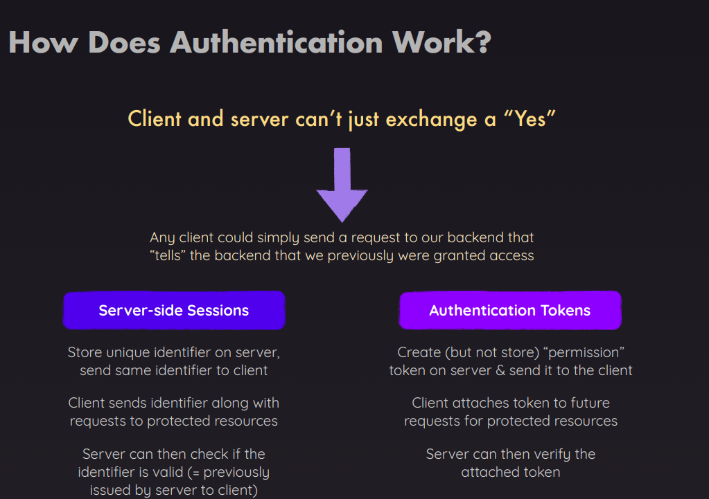
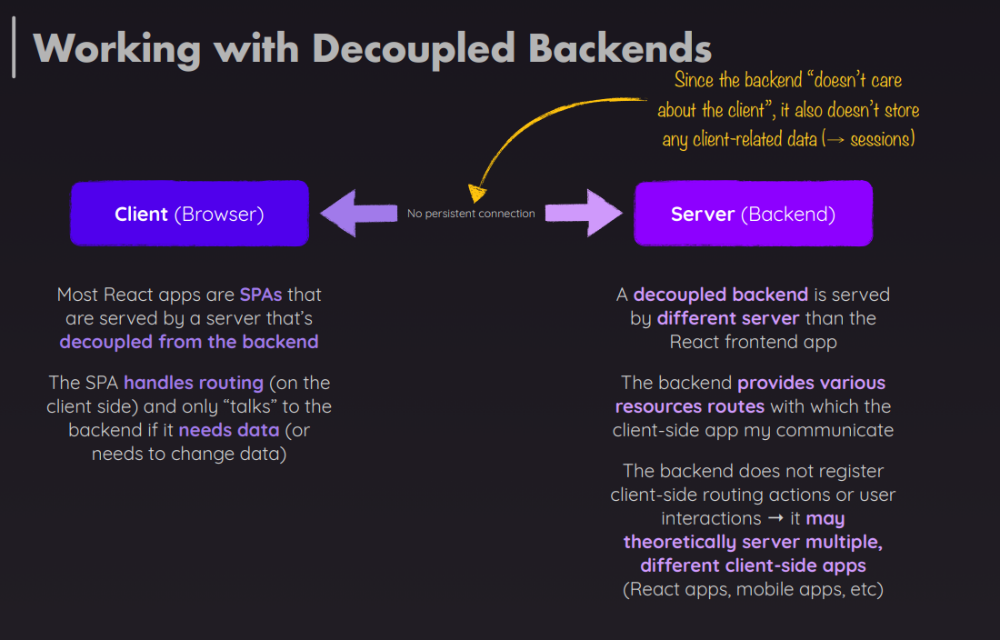
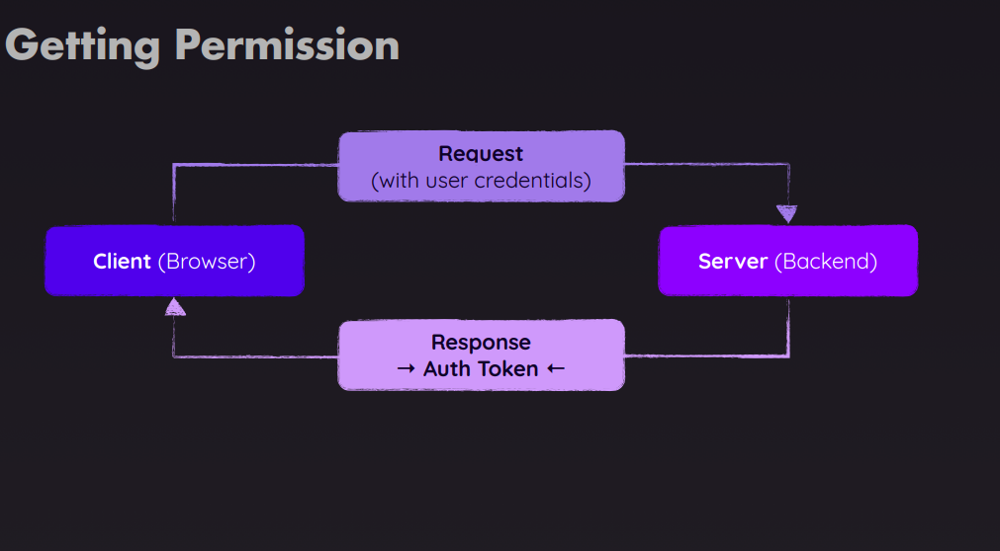

## Authentication to React Applications

- In this Application We are able to create users and log in, and our user interface reflects that, We're then able to work with the different features of this application.
- We can delete events if logged in, because that token is attached to outgoing requests.
- We have that auto logout timer behind the scenes. We can logout manually as well.
- We update the UI, to reflect the current authentication status.
- In addition, we protect certain routes, so that we can't reach routes we're not supposed to reach.

This repository is all about **Authentication**.

- **How Authentication Works** in React Apps
- **Implementing** User Authentication
- Adding Authentication **Persisitence & Auto-Logout**

### How Authentication Works

We have 2 ways to implement authentication in react applications.

1. Server-side Sessions
2. Authentication Tokens

The details is explain in the slide below.

### Working with Decoupled Backends

<small>
Decoupled architecture refers to a system where the frontend (presentation layer) and backend (data layer) are separated, allowing them to operate independently. This separation is achieved through a layer of technical abstraction, such as an API (Application Programming Interface)
</small>

The details about decouple backend is explain in the slide below.

### Getting Permission

We will get an **Auth Token** in response whenever we are login/signup.

The image below demonstrate what we get in response.

#### How to setup this repository

This project actually contains two projects:

- A React.js application (i.e. the frontend SPA)
- A dummy backend API to which the React app can "talk" (to send + fetch data)

You must run **npm install** in both project folders.

Thereafter, you can start the dummy backend API server via **npm start** (inside the "backend-api" folder).
The React app dev server is then also started via **npm start** (though inside the "react-frontend" folder).

You MUST have both servers (backend + frontend) up and running for the projects to work.

The dummy backend API does not use any external database - instead the dummy data is saved to an `events.json` file inside the project folder.
